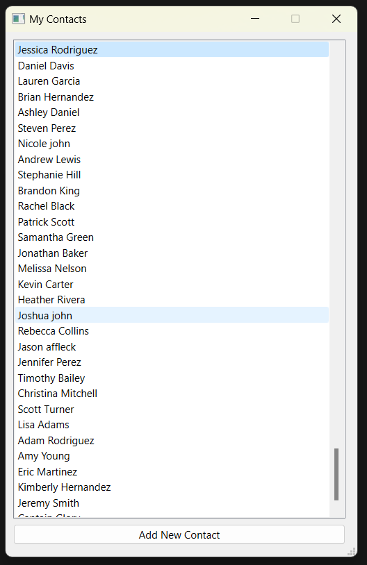
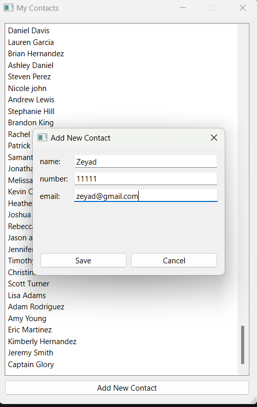
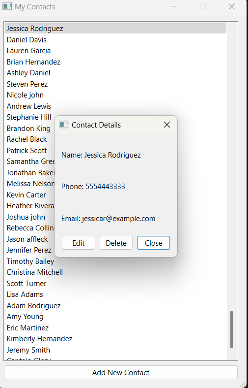

# Contact Manager
A simple and intuitive Qt application for managing contact information.

## Features

- Create, edit, and delete contacts
- View contact details
- Persist contact data

## Preview
<p align="center">
  
  
  
</p>

## Run

```bash
cd release
./ContactManager.exe
```